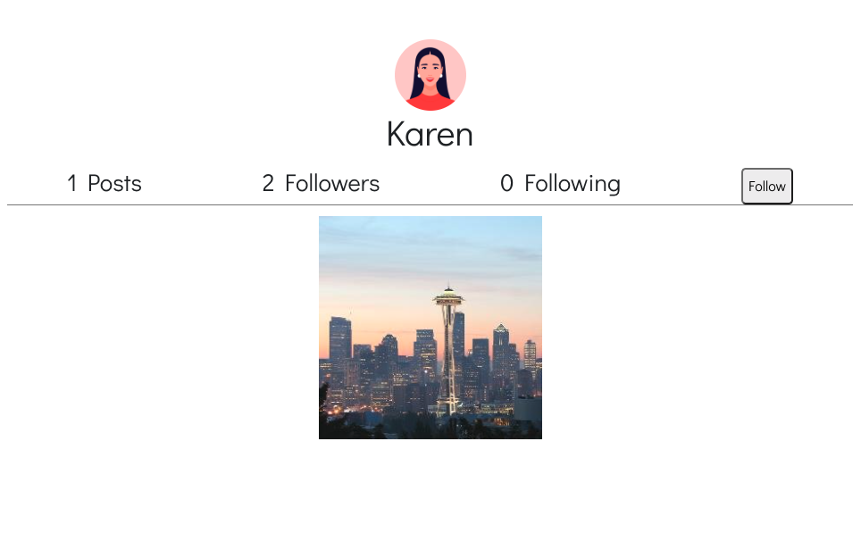

[Live Link](https://nguyenstagram.onrender.com/)
[Video Link](https://www.youtube.com/watch?v=YU4vtYF0-sM)

<h1>Description:</h1>

Full stack photo-sharing application where users may create a profile, upload profile pictures, share photos to a general home-feed, share photos to other users, comments on posts, like posts, search for users, and display notifications for each activity that another user does with their profile (follow them, comment on post, share post, or like a post).

<h1>Languages and tools used:</h1>

  
  
  
  
  
  
  
  

 
<h1>How to use:</h1>

<h2>Log In or Sign Up</h2>
 

Before being able to enter the application, the user create a profile (like with Instagram). The user will be greeted with an option to log in to their account if they already have one or register if they do not.

Below, the user can register for an account and have the option to upload a profile pic. However, they do not need to do so in order to create an account. They can always edit their profile pic later. For now, they will have a default avatar.

We will register as a user named "User123".

 

    

 

<h2>Home Feed</h2>
 

The user is now brought to the main home feed. Here, you will see all the picture posts of every user that is registered on the application. It is sorted by the most recent post on the top.

 

    

 

<h2>Nav Bar</h2>
 

The nav bar is fixed to the left side of the screen. The user's profile pic is show, along with 5 links to the home page, the user's profile page, search function, notifications list, and a log-out button.

 

    

 

Before we start exploring other users' posts and profiles, the user would like to navigate to their own profile page and upload a profile picture and a bio.

To do so, the user click's on the "Profile" link on the nav bar.

 

    

 

<h2>My Profile</h2>
 

The user's profile is pretty blank. There are no posts yet and no activity. The user want's to change that.

The user can click on their profile picture in the center and be brought to a modal where they can upload a picture of themselves.

 

    

 

Using base64 image encoding, the user is able to upload a picture of themselves from their local machine onto the application.

 

    

 

 

    

 

The user confirms that this is the picture they want and hits "confirm".

Now, their profile page has a proper picture that way other users can see what they look like.

 

    

 

The user can also add a short bio too, using the "Add Bio" feature right below their profile pic.

 

    

 

<h2>Uploading a Pic</h2>
 

In order to post their first picture, the user clicks "Post a Pic" at the bottom and now has the ability to upload a picture from their local machine, add a caption, and post it to the general home feed.

 

    

 

 

    

 

After the user confirms their picture and shares, it is now visible in their profile page as well as the home feed.

 

    

 

 

    

 

<h2>Interacting with other users' posts</h2>
 

The user can interact with other users' posts. 

For example, this post by user "Gary" has a picture of London that the user likes. The user will click the heart icon to like the post, and the heart will fill with red color to let the user know that they have already liked the post. The user can click the heart again to unlike it.

 

    

 

The user can comment on the post, saying that they wish they could go to London as well.

 

    

 

The comment will display in the list of comments for the post.

 

    

 

<h2>Sharing a pic</h2>
 

The user can also share this post with another user as well. This user knows the user named "Don", and would like to share this London picture with him.

The user clicks on the arrow button next to the like button and is brought to a modal where they can search for a user to share to.

 

    

 

The user can type in the search bar and the search results will automatically find the user based on what is typed in the search bar.

 

    

 

After selecting user "Don", we can confirm to share this post with him.

 

    

 

Don will now get a notification when he logs in that this post was shared to him, more on that later.

<h2>Search bar feature</h2>
 

Like the sharing feature, we can search for a specific user and be brought to their profile via the search bar feature in the nav bar.

The user clicks on it and sees a modal with a list of users of the application.

 

    

 

Let's search for a user named "Karen".

 

    

 

<h2>Profile page</h2>
 

The user clicks on her profile and is brought to her profile page.

 

    

 

The user sees that Karen has posted a picture of Seattle, which the user likes. The user decides to follow Karen from now on, and also click the picture of Seattle to be brought to the post's page.

 

    

 

<h2>Post page</h2>
 

Here, the user can interact with the post the same way they could on the post while it's displayed in the home feed. The user can like, share, comment on the post the same way. They may also delete their own comments on the post if they choose to do so.

The user decides to like the post, comment on it complimenting Karen, and share it to user "Don" too.

 

    

 

 

    

 

Now, the user will log out and return another time, clicking the "Log out" button on the nav bar.

 

    

 

<h2>Notifications</h2>
 

To check on the "notifications" feature, let's log into the account of user "Don" and see that he was properly notified of the 2 posts that "User123" has shared with him.

 

    

 

As expected, Don is greeted with "New Notifications". He clicks on it and sees his list of all the notifications he's had whenever another user has interacted with his posts or followed.

Also as expected, User123's 2 shared posts are at the top, with the option to click a link to the referenced post, as well as marking the notification as "read" by clicking on the message itself.

 

    

 

Now, user "Don" would like to log out and return another time.